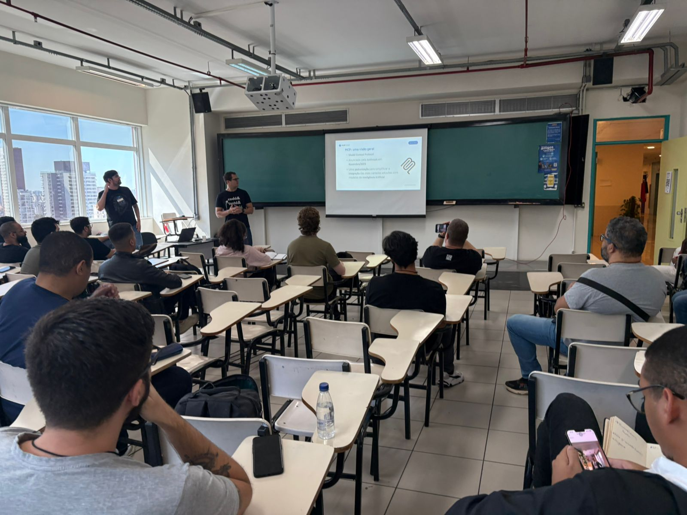
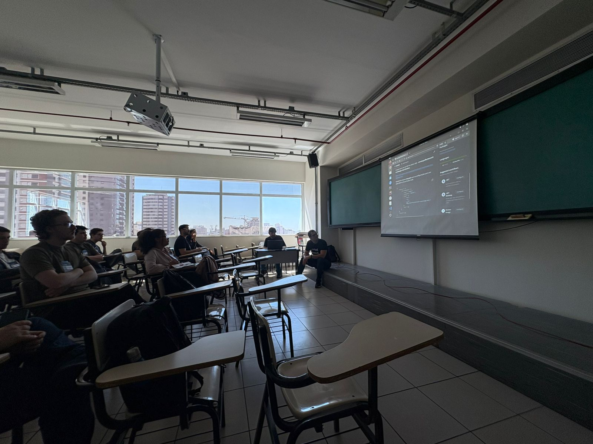
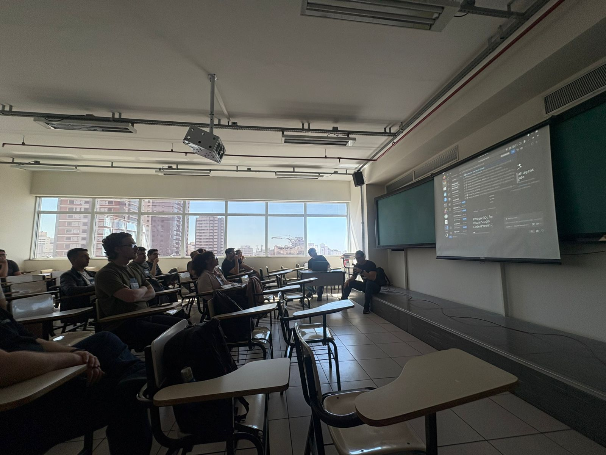
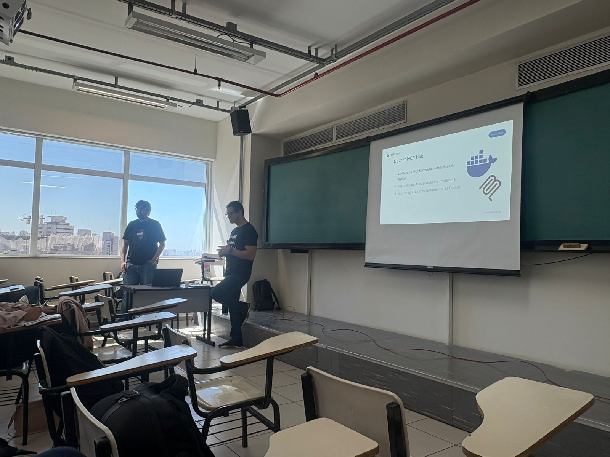

# mcp-bases-relacionais_mvpconf2025
Conteúdos da apresentação "MCP + Bases Relacionais: gerenciando e explorando seus dados com Inteligência Artificial".

Referências:
- Model Context Protocol: https://modelcontextprotocol.io/docs/getting-started/intro
- Docker MCP Hub: https://hub.docker.com/u/mcp
- APIsec University - Certificações gratuitas em Segurança de APIs (incluindo IA): https://www.apisecuniversity.com/
- MCP para geração de dados fake (Container/Docker Hub): https://github.com/renatogroffe/dotnet9-consoleapp-mcp-fakedata
- MCP para geração de dados fake (REST API): https://github.com/renatogroffe/aspnetcore9-mcp-fakedata
- MCP para SQL Server: https://github.com/renatogroffe/sqlserver-mcp-dotnet-tool-scripts
- MCP para geração de dados fake para testes em uma base SQL Server: https://github.com/renatogroffe/dotnet9-mcp-fakedata-sqlserver
- OWASP Top 10 for Large Language Model Applications: https://owasp.org/www-project-top-10-for-large-language-model-applications/
- MCP Servers no Visual Studio Code: https://code.visualstudio.com/docs/copilot/customization/mcp-servers
- Mermaid - Diagramming and charting tool: https://mermaid.js.org/intro/

---

## Informações sobre o evento

Título da apresentação: **MCP + Bases Relacionais: gerenciando e explorando seus dados com Inteligência Artificial**

Data: **25/10/2025 (sábado)**

Tecnologias e tópicos abordados: **MCP, GitHub Copilot, Visual Studio Code, Inteligência Artificial, LLMs, Containers, Docker, Windows, Linux, macOS, .NET, ASP.NET Core, NuGet, Node.js, npm, pip, Python, Claude, SQL Server, PostgreSQL, Mermaid...**

Número de participantes: **20 pessoas**

O MVP Conf 2025 Brasil foi um evento presencial promovido pela comunidade de MVPs Microsoft no Brasil, tendo acontecido nos dias 24 e 25 de Outubro de 2025 em São Paulo-SP e contando com participantes de todo o Brasil.

Site do evento: **https://mvpconf.com.br | https://www.hubingressos.com.br/evento/mvpconf**

Local: **UNIP - Paraíso/Vergueiro - Rua Vergueiro, 1211 - Aclimação - São Paulo-SP - CEP: 01533-000**

Acesse este [**link**](/img/) para visualizar todas as fotos da apresentação.

Esta palestra foi realizada em conjunto com meu amigo **Murilo Beltrame (DEVPIRA)**.

Deixamos aqui nossos agradecimentos à organização do MVP Conf,  ao meu amigo **Hugo Venturini (Microsoft MVP)** que coordenou a trilha de Data Platform e participantes por todo o apoio em nossa palestra.

---

